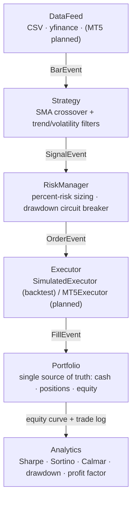

# BossFx — Algorithmic Trading Framework

> A modular, event-driven algorithmic trading framework built so the **backtest behaves exactly like live trading** — no look-ahead bias, realistic execution costs, and risk management as a first-class concern.

**Status:** Phases 1–2 complete, Phase 3 underway. **93 tests across 12 files**, green on CI (Python 3.10 / 3.11 / 3.12). Part of [BossFx](https://github.com/Boss-fx); built by [Timilehin Shobande](https://github.com/Gabby-tech).

---

## Problem

Most retail trading bots lie to you — not maliciously, but structurally. They use vectorized backtests that leak future data, ignore spread and slippage, and size every trade identically regardless of volatility or drawdown. The backtest looks great; the live account blows up.

The hard part of a trading system isn't the entry signal. It's building an evaluation you can actually trust — one where a good backtest number *means something* because the simulation couldn't have cheated.

## Solution

BossFx is built on one principle: **the backtest must behave exactly like live trading, or it's worthless.**

- **Event-driven core.** Every price bar is processed in strict chronological order. No component can see the future.
- **Online indicators.** Moving averages, ATR, etc. are stateful objects that *cannot* be fed future data — look-ahead bias becomes structurally impossible, not merely unlikely.
- **Signal-on-bar-N, fill-on-bar-N+1-open.** The canonical anti-look-ahead pattern: an order can never fill on the bar that produced it.
- **Realistic execution.** Spread, slippage, and commission are applied to every fill. If a strategy only works without costs, we want to know immediately.
- **Risk before returns.** Percent-of-equity position sizing and a drawdown circuit breaker sit between every signal and every order.

## Features

- Hexagonal (ports-and-adapters) architecture — swap any stage without touching the others
- SMA-crossover strategy with composable **trend** (HTF bias) and **volatility** (ATR regime) filters
- **Walk-forward validation** and **grid search** for out-of-sample evaluation
- Percent-risk sizing, configurable stops/targets, drawdown circuit breaker
- Realistic execution simulator (spread / slippage / commission)
- Full performance analytics — Sharpe, Sortino, Calmar, max drawdown, profit factor
- 100% YAML-driven configuration, validated at load time (fails fast on bad input)
- CSV and yfinance data feeds (MT5 live feed planned — see [Roadmap](#roadmap))

## Architecture

Hexagonal architecture: every stage is an abstract contract, so implementations are swappable without rewrites. The same engine runs a backtest today and a live MT5 executor tomorrow — the strategy code doesn't change a line.



Each arrow is a typed event; each box depends only on an interface, never a concrete class.

## Tech stack

`Python 3.10–3.12` · `Pydantic` (config validation) · `pandas` / `numpy` · `PyYAML` · `unittest` · `GitHub Actions` (CI matrix + lint) · `pyproject.toml` packaging

## Project structure

```
bossfx/
├── bossfx/
│   ├── core/          # Events, abstract interfaces, portfolio (source of truth)
│   ├── data/          # CSV + yfinance feeds (MT5 planned)
│   ├── strategies/    # SMA crossover, online indicators
│   │   └── filters/   # Trend (HTF bias) + volatility (ATR regime) filters
│   ├── risk/          # Percent-risk sizing, drawdown circuit breaker
│   ├── backtest/      # Event-driven engine, execution sim, walk-forward, grid search
│   ├── analytics/     # Sharpe, Sortino, Calmar, drawdown, profit factor
│   ├── config/        # YAML → validated config objects
│   └── utils/         # Structured logging
├── configs/           # User-editable YAMLs (incl. 5-year + walk-forward setups)
├── tests/             # 93 tests across 12 files
├── scripts/           # run_backtest, run_walkforward (CLI entry points)
└── pyproject.toml
```

## Getting started

```bash
git clone https://github.com/Boss-fx/bossfx-sma-bot_.git
cd bossfx-sma-bot_
pip install -e ".[dev]"     # or: pip install -r requirements.txt
```

Run a backtest:

```bash
python -m scripts.run_backtest --config configs/eurusd_sma_default.yaml
```

Run the test suite:

```bash
python -m unittest discover tests -v   # 93 tests
```

## Usage

Everything is driven by YAML — change parameters in a config, never in the code. Bad configs fail at load time (Pydantic-validated), not three hours into a run.

```yaml
# configs/eurusd_sma_default.yaml
data:      { source: csv, symbol: EURUSD, timeframe: 1h, csv_path: tests/fixtures/eurusd_1h_sample.csv }
strategy:  { fast_period: 20, slow_period: 50 }
risk:      { initial_cash: 10000.0, risk_per_trade_pct: 0.01, stop_loss_pct: 0.005, take_profit_pct: 0.010 }
execution: { spread_pips: 1.0, slippage_pips: 0.5, commission_per_lot: 7.0 }
```

The `default` config runs against a small bundled sample (≈2,000 bars) as a **functional smoke test** — it verifies the pipeline end-to-end, and its numbers are **not** a performance claim. For real evaluation, `configs/` ships multi-year and walk-forward setups (`eurusd_5y_baseline.yaml`, `eurusd_5y_trend_vol.yaml`, `walkforward_5y.yaml`, …); point them at your own EURUSD history:

```bash
python -m scripts.run_walkforward --config configs/walkforward_5y.yaml
```

## Engineering decisions

- **Event-driven over vectorized.** Vectorized backtests are faster to write and almost always leak the future. An event loop is the price of a result you can trust — and it's the same loop that will run live.
- **Online, stateful indicators.** Making indicators incapable of seeing future data turns "no look-ahead" from a code-review promise into a structural guarantee the tests can prove.
- **Hexagonal boundaries.** The backtest and (future) live executor implement the same `Executor` interface, so going live doesn't touch the engine. The cost is more interfaces up front; the payoff is no rewrite later.
- **Config-as-data.** YAML + fail-fast validation keeps experiments reproducible and stops a typo from silently invalidating a run.

## Technical challenges

- **Proving the absence of look-ahead.** It's easy to *claim* no future leakage; hard to *prove* it. The fix is structural — the signal/fill separation and online indicators are designed so a look-ahead bug can't slip past the tests (see Tier 2 below).
- **Accounting integrity.** Cash, positions, and equity must reconcile on every event. A silent off-by-one in fill accounting is money that disappears — Tier 1 tests guard every invariant.

## Testing

**93 tests across 12 files**, run on every push/PR across Python 3.10, 3.11, and 3.12, plus an end-to-end smoke backtest and a lint job. Each test defends one of three failure modes:

1. **Tier 1 — Accounting invariants** (`test_portfolio.py`, `test_events.py`, `test_execution.py`). Does one dollar in equal one dollar out? These are the tests where money silently disappears if they fail.
2. **Tier 2 — No-look-ahead invariants** (`test_indicators.py`). Can any component produce a value influenced by data it hasn't seen yet? Proven structurally, not assumed.
3. **Tier 3 — Behavioral correctness** (strategy, risk, filters, walk-forward, end-to-end). Does the SMA compute the right value? Does the crossover fire once per cross? Does sizing math hold?

## Roadmap

- [x] **Phase 1 — Foundation.** Event-driven core, abstract interfaces, validated configs, realistic execution modeling, CI.
- [x] **Phase 2 — Strategy & risk upgrades.** Trend filter (HTF bias), ATR volatility filter, composable filter stack.
- [ ] **Phase 3 — Robust evaluation** *(in progress).* Walk-forward validation ✅ and grid search ✅; Monte Carlo equity-curve confidence intervals and parameter-stability tests next.
- [ ] **Phase 4 — Analytics & reporting.** HTML reports, strategy comparison, trade-level MAE/MFE.
- [ ] **Phase 5 — Productization.** MT5 live executor, multi-strategy/multi-asset portfolios, Optuna optimization, dashboard.

## Design principles

1. **Backtest honesty over backtest beauty.** An 8% return with honest assumptions beats a 40% return built on hidden leakage.
2. **Every component is replaceable.** Interfaces are contracts; implementations plug in. No god class.
3. **Production-ready means boring.** Defensive, well-logged, well-tested code that won't surprise you at 3am when EURUSD spikes on an NFP print.

## License

Released under the [MIT License](LICENSE).

## Credits

Built by [Timilehin Shobande](https://github.com/Gabby-tech) — software engineer & founder, [BossFx](https://github.com/Boss-fx).
